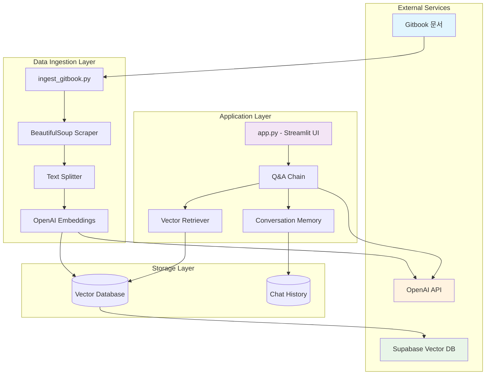
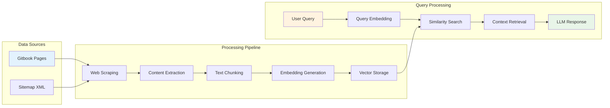
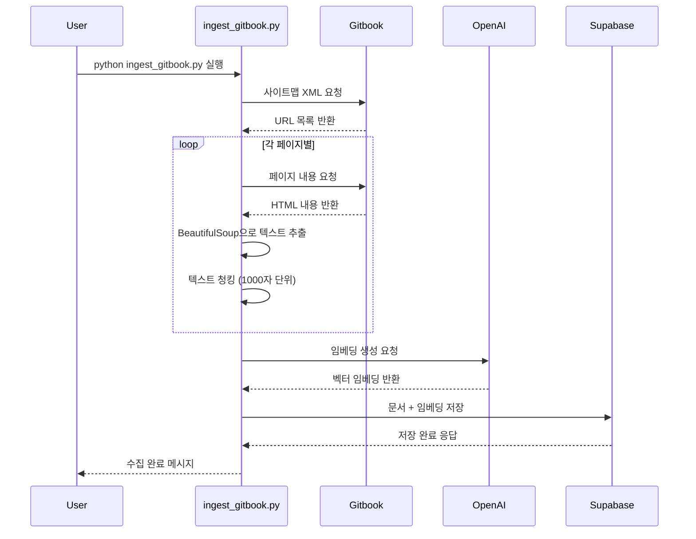
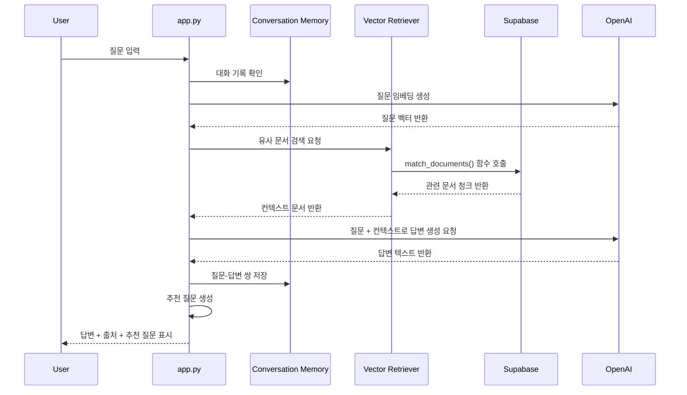
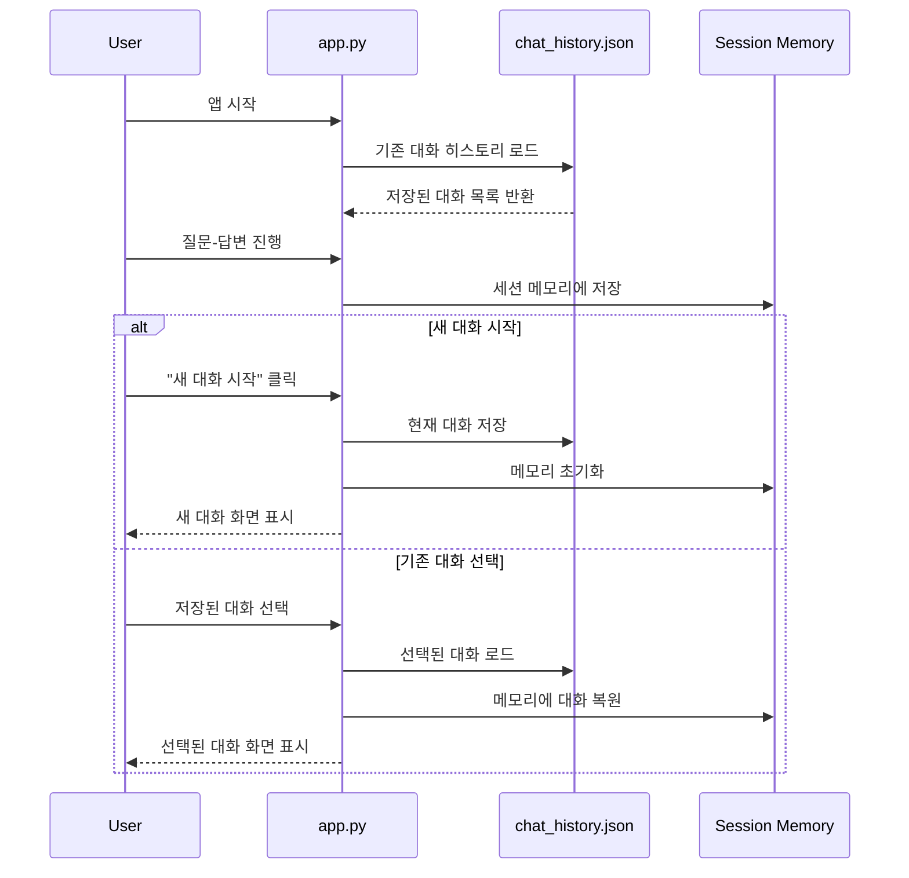

# Gitbook Q&A Chatbot

Gitbook 문서를 기반으로 질문에 답변해주는 챗봇입니다. Supabase Vector DB와 OpenAI의 임베딩 및 LLM을 활용하여 제작되었습니다.

## 설치 방법

1. 필요한 패키지 설치:
```bash
pip install -r requirements.txt
```

2. 필요한 추가 패키지 설치:
```bash
pip install supabase
```

3. 환경 변수 설정:
```bash
python create_env.py
```
생성된 `.env` 파일을 편집하여 다음 내용을 입력하세요:
- `OPENAI_API_KEY`: OpenAI API 키 
- `SUPABASE_URL`: Supabase 프로젝트 URL
- `SUPABASE_ANON_KEY`: Supabase 익명 키
- `TARGET_GITBOOK_NAME`: 대상 Gitbook 이름 (선택 사항)

## Supabase 설정

1. Supabase 프로젝트 생성
2. pgvector 확장 활성화
3. 스키마 설정 방법:
   - 방법 1: Supabase SQL 에디터에서 `supabase_schema.sql` 내용을 직접 실행
   - 방법 2: 스키마 초기화 스크립트 실행 (표시된 SQL문을 Supabase SQL 에디터에 복사하여 실행)
   ```bash
   python reset_supabase_schema.py
   ```

### 타입 불일치 오류 해결

UUID 타입 오류가 발생하는 경우 다음 단계를 수행하세요:

1. `reset_supabase_schema.py`를 실행하여 필요한 SQL 명령어 확인
2. 표시된 SQL 명령어를 Supabase SQL 에디터에 복사하여 실행:
   - 기존 테이블과 함수 삭제
   - UUID 타입을 사용하는 새 테이블 생성
   - 새 매칭 함수 생성

## 사용 방법

1. Gitbook 문서 수집 및 임베딩:
```bash
python ingest_gitbook.py
```

2. 웹 인터페이스 실행:
```bash
streamlit run app.py
```

## 주요 기능

- Gitbook 문서 크롤링 및 임베딩
- 입력 질문에 대한 관련 문서 검색
- OpenAI 모델을 통한 답변 생성
- 출처 문서 표시

## 시스템 아키텍처

### 전체 시스템 구조



### 데이터 흐름 아키텍처



## 시퀀스 다이어그램

### 문서 수집 및 임베딩 프로세스



### 사용자 질의응답 프로세스



### 대화 히스토리 관리 프로세스



## 파일 구조

- `app.py`: Streamlit 웹 인터페이스
- `ingest_gitbook.py`: 문서 수집 및 임베딩 스크립트
- `supabase_schema.sql`: Supabase 데이터베이스 스키마
- `reset_supabase_schema.py`: Supabase 스키마 초기화 스크립트
- `requirements.txt`: 필요 패키지 목록
- `create_env.py`: 환경 변수 파일 생성 도우미

## 문제 해결

- **GitbookLoader가 작동하지 않는 경우**: 스크립트는 BeautifulSoup 기반 추출로 자동 대체됩니다.
- **Supabase 연결 오류**: `.env` 파일 설정 및 Supabase 프로젝트 설정 확인
- **임베딩 오류**: OpenAI API 키 유효성 확인
- **UUID 타입 오류**: Supabase 테이블 구조가 최신 스키마와 일치하지 않을 때 발생합니다. `reset_supabase_schema.py`를 참고하여 스키마를 업데이트하세요. 